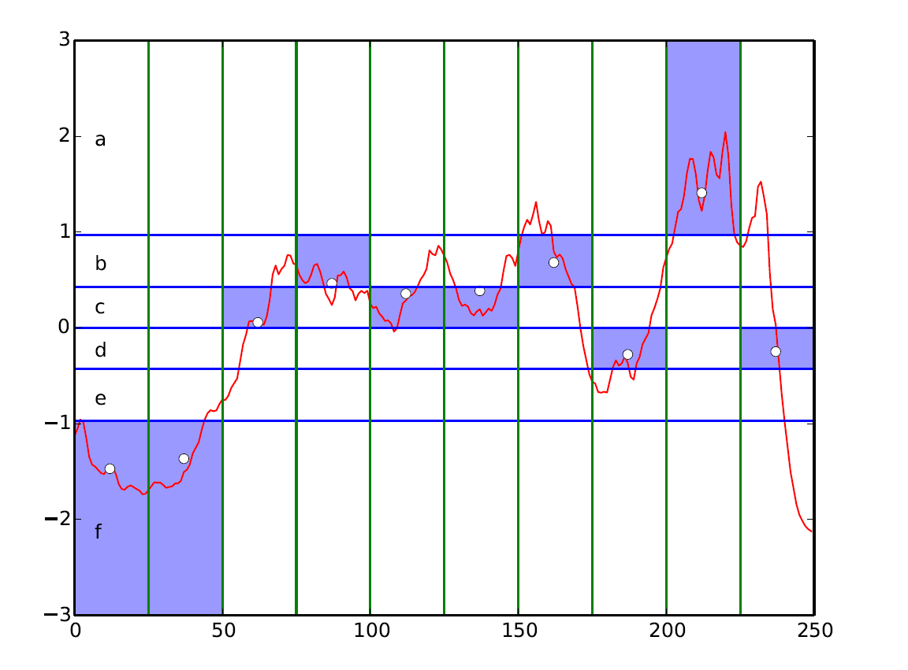
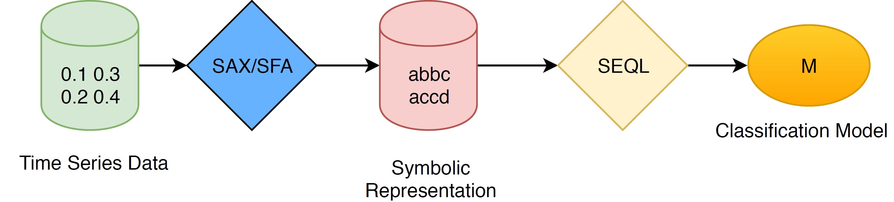
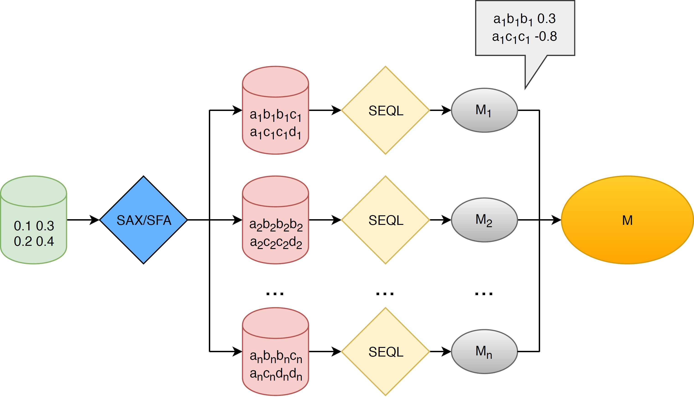
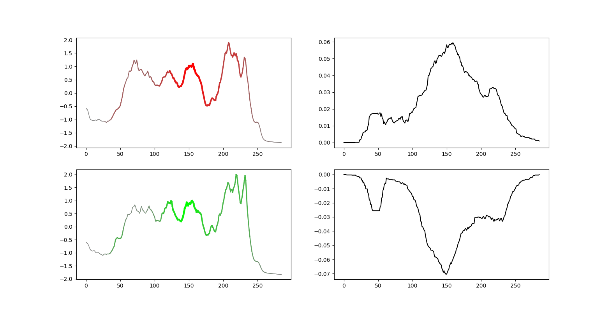

# Time Series Classification with SEQL

## Description

Mr-SEQL is a time series classification software which utilizes linear models and multiple symbolic representations of time series to deliver an accurate and interpretable time series classifier.


## SAX

<p align="center">

</p>

SAX is a transformation method to convert a numeric vector to a symbolic representation, i.e., a sequence of symbols from a predefined alphabet *a*. SAX first computes the Piecewise Aggregate Approximation (PAA) of a time series in the time domain and then transforms this approximation to a symbolic representation.

PAA reduces a time series of length L to a vector of length *l* (*l* < *L* is also the length of the symbolic sequence) by dividing the time series into equal segments. Each segment is then replaced with its mean value.

PAA is then followed by a discretisation step which replaces each value of the PAA with a corresponding symbol. The symbol is selected from the alphabet based on the interval in which the value falls. There are *a* intervals, as many as the size of the alphabet. Each interval is associated with a symbol from the alphabet. Assuming that the time series is normal distributed, the intervals are divided under the normal distribution (i.e. *N*(0,1)) with equal probability.

## SFA

SFA also transforms a time series to a symbolic representation, but this time using the frequency domain for the discretisation. The core differences between SAX and SFA are the choices of approximation and discretisation techniques. SFA uses a Discreet Fourier Transform (DFT) method to approximate a time series.

More information on SFA can be found here: https://github.com/patrickzib/SFA


## SEQL

SEQL is a symbolic (e.g., abcd aabc ...) sequence learning algorithm that can efficiently traverse a large feature space (all variable-length subesequences in the training data are used as features) and selects the most discriminative subsequences for a linear model, based on a  training dataset.

The original SEQL software and its description can be found here: https://github.com/heerme/seql-sequence-learner

## Combination of SEQL and symbolic representations of time series

## Single Representation

SEQL learns a linear classification model from the symbolic representation of time series (either SAX or SFA).

<p align="center">

</p>

## Multiple Representations

SEQL can be combined with symbolic representations of multiple resolutions and multiple domains.

<p align="center">

</p>

## Interpretation

As our classifier is linear, the model itself is interpretable. Furthermore, we can visualize the SAX features selected by SEQL in the raw time series domain.

<p align="center">

</p>

## Installation

Requires: cmake for compiling the C source code.
To compile execute following commands in the src directory:

```
mkdir -p build
cd build
mkdir -p Release
cd Release
cmake -DCMAKE_BUILD_TYPE=Release ../../
make
cd bin
```


## How to Use

Copy data to the working directory. Create a new directory to store output:

```
cp ../../../../data/Coffee/Coffee_* .
mkdir saxdir
```

Prepare the SAX representations for Coffee_TRAIN and output results in "saxdir/sax.train". Parameter configurations are saved in "saxdir/config":

```
./sax_convert -i Coffee_TRAIN -o saxdir/sax.train > saxdir/config
```
Prepare the SAX representations for Coffee_TEST and output results in "saxdir/sax.test"

```
./sax_convert -i Coffee_TEST -o saxdir/sax.test
```

Classify with Ensemble SEQL. The outputs stored in saxdir also include the features selected by SEQL and the vector space representation for the train/test data. This can subsequently be used for training another classifier such as logistic regression (or any other classifier):

```
./mr_seql -t saxdir/sax.train -T saxdir/sax.test -o saxdir
```

The following example uses sklearn Logistic Regression for classification with the selected features. In this scenario, SEQL is used for feature selection. Data transformed in a feature vector space and fed to a logistic regression classifier:

```
python mf_logreg.py saxdir
```

We also provide the code to plot highlighted time series. First we compute the classification score for each point in the time series, by mapping the discriminative symbolic subsequence back to the raw time series.

```
./compute_metats -c saxdir/config -p saxdir/features -i Coffee_TEST -o saxdir/test_scores
```
Then plot the results with python (Python 3.x + matplotlib):

```
python visual_timeseries.py Coffee_TEST saxdir/test_scores 1
```

The steps to use the SFA representation are similar. We provide in the src folder the python script that can work with the [Python port of SFA](https://github.com/sharford5/SFA_Python). To combine SFA features and SAX features for classification, simply add both directories to the above command:

```
python mf_logreg.py saxdir sfadir
```

## References

Our paper:

[Time Series Classification by Sequence Learning in All-Subsequence Space](https://ieeexplore.ieee.org/document/7930038/)

[Interpretable Time Series Classification using All-Subsequence Learning and Symbolic Representations in Time and Frequency Domains](https://arxiv.org/abs/1808.04022)

Other SEQL-based projects:

https://github.com/heerme/seql-sequence-learner

https://github.com/lnthach/SAX-SEQL

https://github.com/svgsponer/SqLoss

Read more about SAX and other time series techniques [here](http://www.cs.ucr.edu/~eamonn/). The site also hosts the popular UCR Time Series Classification Archive.

[SFA implementation by the author](https://github.com/patrickzib/SFA).

[The UEA & UCR Time Series Classification Repository](http://timeseriesclassification.com). Datasets and implementations of most state-of-the-art time series classifiers can be found here.

## Acknowledgements

This work was funded by Science Foundation Ireland (SFI).

Many thanks to [Martin](https://www.researchgate.net/profile/Martin_Oreilly4) for his contribution to the case study on the jump data.

Disclaimer
----------
These software distributions are open source, licensed under the GNU General Public License (v3 or later). 
Note that this is the full GPL, which allows many free uses, but does not allow its incorporation 
(even in part or in translation) into any type of proprietary software which you distribute. 
Commercial licensing is also available; please contact us if you are interested.
 
This program is distributed in the hope that it will be useful,
but WITHOUT ANY WARRANTY; without even the implied warranty of
MERCHANTABILITY or FITNESS FOR A PARTICULAR PURPOSE. See the
GNU General Public License for more details.
